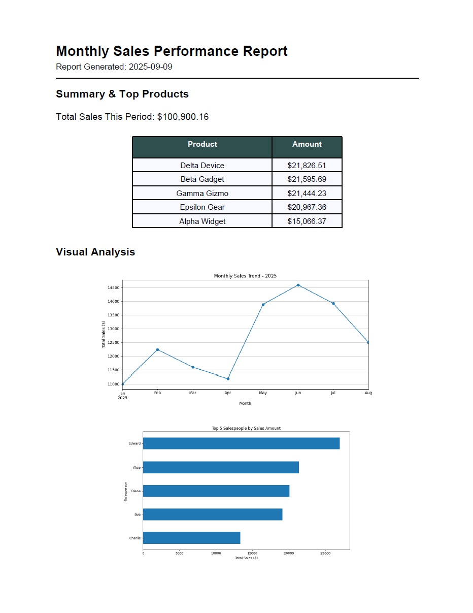

## Problem
Does your team spend hours every month manually copying data from spreadsheets into reports? Do formatting inconsistencies and the risk of human error make your business look unprofessional?

## Solution
This automation tool transforms raw CSV or Excel data into polished, professional PDF reports in minutes, not hours. It's a demonstration of how a targeted automation can reclaim valuable time and ensure perfect consistency.

## Before vs. After
- **Manual Process:** 2-3 hours of copy/pasteing, formatting, and chart creation.
- **Automated Process:** Under 5 minutes to generate a consistent, professional, and error-free report.

## Tangible Business Impact
- **Time Savings:** Save 8-12 hours per month on this single reporting task.
- **Error Elimiination:** Remove the risk of human error in data transfer and calculations.
- **Enhanced Professionalism:** Ensure professional, consistently branded formatting every single time.
- **Strategic Focus:** Allow your staff to spend their time on *analyzing* the data, not just preparing it.

## How It Works (High-Level)
This tool is built with clean, modular Python script. It intelligently parses input data, performs necessary calculations, and uses pre-defined templates to generate a professional PDF output complete with tables and charts. The code is well-commented and designed for easy customization.
## How to Use

This tool is designed to be run from the command line. Follow these steps to generate your own report:

### 1. Prerequisites

- Ensure you have Python 3.8+ installed on your system.
- It is highly recommended to use a virtual environment to manage dependencies.

### 2. Installation

Clone this repository to your local machine and install the required packages:

```bash
# Clone the repository
git clone [https://github.com/soarzautomation/Automated-Report-Generator.git](https://github.com/soarzautomation/Automated-Report-Generator.git)

# Navigate into the project directory
cd Automated-Report-Generator

# Create and activate a virtual environment
python -m venv venv
source venv/bin/activate  # On Windows, use `venv\Scripts\activate`

# Install the required packages
pip install -r requirements.txt
```

### 3. Execution

Place your input data file (e.g., `sales_data.csv`) in the root of the project directory. Then, run the script:

```bash
python main.py
```

The script will generate a new PDF report inside the `reports` folder.sales_summary`

